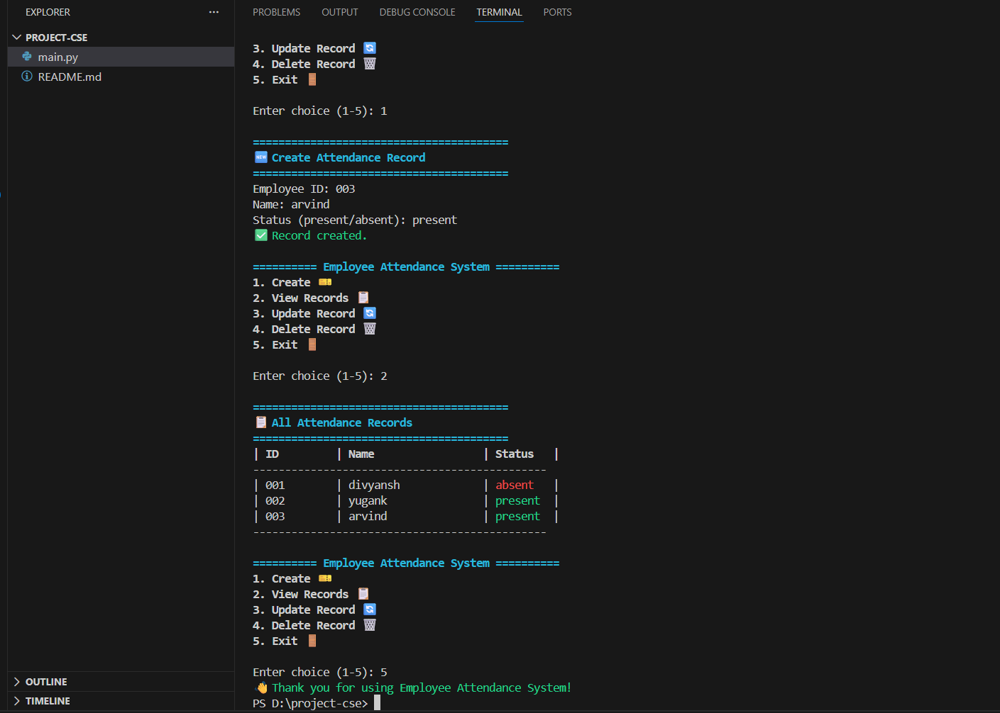

# **Employee Attendance System**


---

## **EXECUTIVE SUMMARY**

This project is a **simple yet robust command-line application** for managing employee attendance records. Built using Python with **input validation**, **CRUD operations**, and a **user-friendly terminal interface**, the system demonstrates core programming concepts including data structures, validation logic, and user interaction design.

**Key Features:** Data validation, CRUD operations, colored terminal output, error handling

---

## **TABLE OF CONTENTS**

1. [Project Overview](#overview)
2. [Problem Statement](#problem)
3. [Objectives](#objectives)
4. [System Design](#design)
5. [Implementation Details](#implementation)
6. [How It Works](#howworks)
7. [Key Features](#features)
8. [Usage Guide](#usage)
9. [Validation Rules](#validation)
10. [Challenges & Solutions](#challenges)
11. [Learning Outcomes](#learning)
12. [File Structure](#files)
13. [Conclusion](#conclusion)

---

## **1. PROJECT OVERVIEW** {#overview}

**Project Name:** Employee Attendance System (CLI)

**Type:** Command-line application (CRUD System)

**Language:** Python 3

**Purpose:** To provide a simple, effective way to manage employee attendance records with proper input validation and error handling.

**Use Case:** Small organizations, educational institutions, or team attendance tracking

---

## **2. PROBLEM STATEMENT** {#problem}

### **Challenge**
Manual attendance management is:
- ❌ Time-consuming (manual data entry)
- ❌ Error-prone (typos, invalid data)
- ❌ Disorganized (no centralized system)
- ❌ Inconsistent (different formats)

### **Solution**
A simple, user-friendly system that:
- ✅ Validates all inputs (names, IDs, status)
- ✅ Prevents duplicate entries
- ✅ Provides instant data access
- ✅ Maintains consistent records

---

## **3. OBJECTIVES** {#objectives}

### **Primary Objectives**
1. Build a working CRUD (Create, Read, Update, Delete) system
2. Implement input validation for data integrity
3. Create user-friendly terminal interface
4. Handle errors gracefully
5. Store records in memory for quick access

### **Secondary Objectives**
1. Practice Python programming fundamentals
2. Learn about input validation techniques
3. Understand CRUD operations
4. Improve code organization and clarity
5. Create professional terminal output

---

## **4. SYSTEM DESIGN** {#design}

### **Architecture**

```
┌─────────────────────────────────────┐
│     User Interface (Menu)            │
│   1. Create  2. Read  3. Update     │
│   4. Delete  5. Exit                │
└────────────┬────────────────────────┘
             ↓
┌─────────────────────────────────────┐
│   Validation Layer                   │
│  - Name validation (alphabets only)  │
│  - ID uniqueness check               │
│  - Status validation (present/absent)│
└────────────┬────────────────────────┘
             ↓
┌─────────────────────────────────────┐
│   Business Logic Layer               │
│  - Create records                    │
│  - Read/display records              │
│  - Update records                    │
│  - Delete records                    │
└────────────┬────────────────────────┘
             ↓
┌─────────────────────────────────────┐
│   Data Storage (In-Memory)           │
│   attendance_list = []               │
│   [{'id': '101', 'name': '...', ... }]
└─────────────────────────────────────┘
```

### **Data Structure**

```python
attendance_list = [
    {
        'id': 'E001',           # Unique employee ID
        'name': 'John Doe',     # Employee name (alphabets only)
        'status': 'present'     # present or absent
    },
    {
        'id': 'E002',
        'name': 'Jane Smith',
        'status': 'absent'
    }
]
```

---

## **5. IMPLEMENTATION DETAILS** {#implementation}

### **Core Components**

#### **A. Validation Functions**

```python
def is_valid_name(name):
    """Check if name contains only alphabets (spaces allowed)"""
    return name.replace(" ", "").isalpha()

def is_unique_id(employee_id):
    """Check if employee ID doesn't already exist"""
    return not any(rec['id'] == employee_id for rec in attendance_list)

def is_valid_status(status):
    """Check if status is 'present' or 'absent'"""
    return status.lower() in ("present", "absent")
```

**Why validation?**
- Prevents garbage data entry
- Ensures data consistency
- Reduces errors and bugs
- Makes system reliable

#### **B. CRUD Operations**

**CREATE:** Add new attendance record
```python
def create_attendance():
    # Validate ID (not empty, unique)
    # Validate Name (alphabets only)
    # Validate Status (present/absent)
    # Add to list
```

**READ:** Display all records in formatted table
```python
def read_attendance():
    # Display as formatted table
    # Show ID, Name, Status
    # Color code status (green/red)
```

**UPDATE:** Modify existing record
```python
def update_attendance():
    # Find by ID
    # Change status
    # Validate new status
```

**DELETE:** Remove record by ID
```python
def delete_attendance():
    # Find by ID
    # Remove from list
    # Confirm deletion
```

---

## **6. HOW IT WORKS** {#howworks}

### **Step-by-Step Flow**

**Starting the Program:**
```bash
python attendance_system.py
```

**User sees Menu:**
```
========== Employee Attendance System ==========
1. Create 🎫
2. View Records 📋
3. Update Record 🔄
4. Delete Record 🗑️
5. Exit 🚪
```

**Example: Creating a Record**

```
User input: 1 (Create)
    ↓
System asks: "Employee ID: " → User: "E001"
    ↓
Validation: Is ID empty? NO ✅
Validation: Is ID unique? YES ✅
    ↓
System asks: "Name: " → User: "Raj Kumar"
    ↓
Validation: Has only alphabets? YES ✅
    ↓
System asks: "Status: " → User: "present"
    ↓
Validation: Is 'present' or 'absent'? YES ✅
    ↓
Record created and added to list
    ↓
System shows: "✅ Record created."
```

**Example: Reading Records**

```
User input: 2 (View)
    ↓
System displays table:
| ID    | Name        | Status   |
| E001  | Raj Kumar   | present  |
| E002  | Priya Singh | absent   |
```

---

## **7. KEY FEATURES** {#features}

### **Feature 1: Input Validation**

| Input | Rule | Example |
|-------|------|---------|
| Name | Only alphabets (spaces allowed) | ❌ "John123" → Rejected ✅ "John Doe" → Accepted |
| ID | Not empty, must be unique | ❌ "" → Rejected ❌ Duplicate → Rejected |
| Status | "present" or "absent" only | ❌ "maybe" → Rejected ✅ "present" → Accepted |

### **Feature 2: Error Handling**

```python
# If name has numbers:
❌ "Name must contain only alphabets. Please enter again."

# If ID already exists:
❌ "Employee ID already exists. Please enter a unique ID."

# If status is invalid:
❌ "Status must be 'present' or 'absent'. Please enter again."
```

### **Feature 3: Colored Terminal Output**

```python
GREEN = "\033[92m"    # Success messages
RED = "\033[91m"      # Error/warning messages
CYAN = "\033[96m"     # Headings
```

Output looks like:
```
✅ Record created. (in green)
❌ Employee not found. (in red)
========== Heading ========== (in cyan)
```

### **Feature 4: Formatted Table Display**

```
| ID         | Name                 | Status   |
--------------------------------------------
| E001       | Raj Kumar            | present  |
| E002       | Priya Singh          | absent   |
```

---

## **8. USAGE GUIDE** {#usage}

### **Installation**

**Prerequisites:**
- Python 3.6 or higher
- Terminal/Command Prompt

**Steps:**
1. Save code as `attendance_system.py`
2. Open terminal in that folder
3. Run: `python attendance_system.py`

### **Menu Operations**

**1. CREATE (Add new employee)**
```
Enter: 1
ID: E001
Name: Raj Kumar
Status: present
Result: ✅ Record created
```

**2. READ (View all records)**
```
Enter: 2
Shows table with all records
```

**3. UPDATE (Change status)**
```
Enter: 3
ID: E001
New Status: absent
Result: ✅ Record updated
```

**4. DELETE (Remove record)**
```
Enter: 4
ID: E001
Result: ✅ Record deleted
```

**5. EXIT (Quit program)**
```
Enter: 5
Program closes
```

---

## **9. VALIDATION RULES** {#validation}

### **Employee ID Rules**
- ✅ Must not be empty
- ✅ Must be unique (no duplicates)
- ✅ Can contain letters and numbers
- Example: "E001", "EMP123", "001"

### **Name Rules**
- ✅ Must contain only alphabets (A-Z, a-z)
- ✅ Spaces are allowed (for full names)
- ✅ No numbers or special characters
- ❌ Invalid: "John123", "Raj@Kumar", "Priya#"
- ✅ Valid: "John Doe", "Raj Kumar", "Priya Singh"

### **Status Rules**
- ✅ Only two options: "present" or "absent"
- ✅ Case-insensitive (PRESENT, Present, present all work)
- ❌ Invalid: "maybe", "late", "sick"
- ✅ Valid: "present", "absent"

---

## **10. CHALLENGES & SOLUTIONS** {#challenges}

| Challenge | Problem | Solution |
|-----------|---------|----------|
| **Invalid Input** | User enters wrong data type | Validate each input with functions |
| **Duplicate IDs** | Same ID entered twice | Check against existing list before adding |
| **User Confusion** | Unclear menu options | Use emojis and clear headings |
| **Terminal Readability** | Hard to read output | Use colors, tables, and formatting |
| **Data Loss** | Records lost on exit | (Future: Save to file/database) |

---

## **11. LEARNING OUTCOMES** {#learning}

### **Technical Skills Demonstrated**

✅ **Python Fundamentals**
- Functions and scope
- Lists and dictionaries
- Loops and conditionals
- String operations

✅ **Data Validation**
- Input checking
- Type validation
- Business rule validation
- Error prevention

✅ **Code Organization**
- Modular functions
- Separation of concerns
- Clear naming conventions
- Comments and documentation

✅ **User Interface Design**
- Menu-driven interface
- User-friendly messages
- Colored output (ANSI codes)
- Error messages and feedback

### **Soft Skills**

✅ Problem-solving approach
✅ Code structure and organization
✅ Error handling thinking
✅ User experience consideration
✅ Testing and validation mindset

---

## **12. FILE STRUCTURE** {#files}

```
employee-attendance-system/
│
├── attendance_system.py      # Main application file
├── README.md                 # Project documentation
│
└── screenshots/              # Project screenshots
    ├── main_menu.png
    ├── create_record.png
    ├── view_records.png
    ├── update_record.png
    └── delete_record.png
```

### **File Details**

| File | Purpose | Size |
|------|---------|------|
| `attendance_system.py` | Complete working application | ~150 lines |
| `README.md` | User guide and overview | ~50 lines |
| `screenshots/` | Visual documentation | 5 PNG files |


## 🖼️ Screenshots

- See the **screenshots** folder for examples of how the app looks in the terminal.




---

## **13. FUTURE ENHANCEMENTS** {#future}

### **Phase 2: File Persistence**
- Save records to file (CSV or JSON)
- Load records on startup
- Permanent data storage

### **Phase 3: Database Integration**
- Use SQLite database
- Complex queries
- Multiple users/departments

### **Phase 4: Advanced Features**
- Date tracking (check-in/check-out times)
- Reports (attendance percentage)
- Search functionality
- Export to Excel/PDF

### **Phase 5: Web Interface**
- Convert to web app (Flask/Django)
- User login system
- Remote access
- Mobile-friendly design

---

## **14. CONCLUSION** {#conclusion}

### **Project Summary**

The **Employee Attendance System** successfully demonstrates:
- ✅ Core Python programming concepts
- ✅ Input validation and error handling
- ✅ CRUD operations on data
- ✅ User-friendly interface design
- ✅ Professional code organization

### **Key Achievements**

1. **Working Application:** Fully functional CRUD system
2. **Robust Validation:** All inputs properly validated
3. **User-Friendly:** Clear menu and colored output
4. **Clean Code:** Well-organized and documented
5. **Professional Structure:** Ready for GitHub and portfolio

### **Practical Value**

While simple, this system demonstrates real-world programming concepts used in professional applications:
- Data validation (every company needs this!)
- Error handling (prevents crashes)
- User interface design (makes it usable)
- Code organization (makes it maintainable)

### **Educational Value**

Perfect for:
- Learning Python basics
- Understanding CRUD operations
- Practicing input validation
- Building portfolio projects
- First programming assignment

---

## **APPENDIX: Quick Start**

```bash
# Clone repository
git clone https://github.com/your-username/project-attendance_system
cd project-attendance_system

# Run program
python main.py

# Follow menu instructions
```

---

## **STUDENT INFORMATION**

**Name:** Akaksh samdani
**Roll Number:** 25BCG10033
**College:** VIT bhopal University
**Date:** November 25, 2025  
**GitHub:** https://github.com/your-username/employee-attendance-system

---

**END OF REPORT**

*Simple yet comprehensive project demonstrating Python fundamentals and software design principles*
